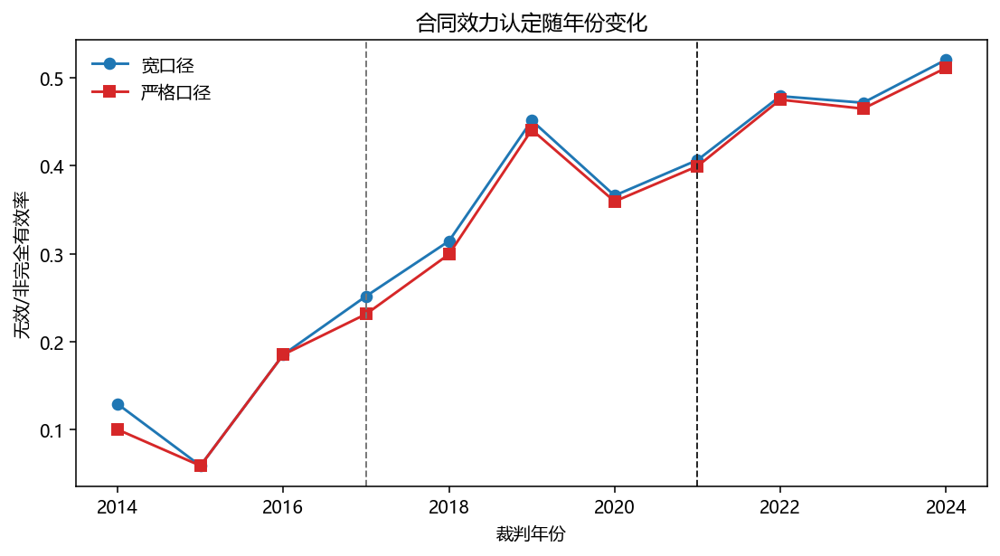
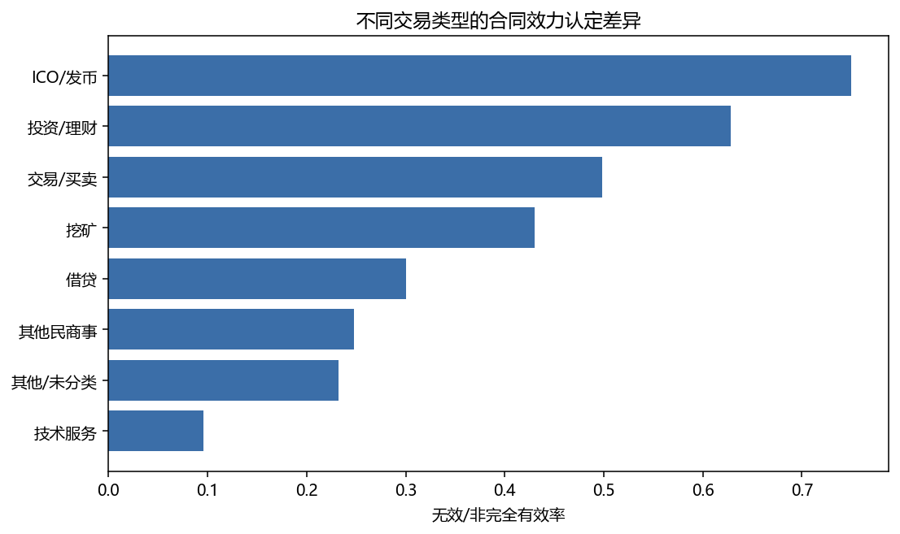
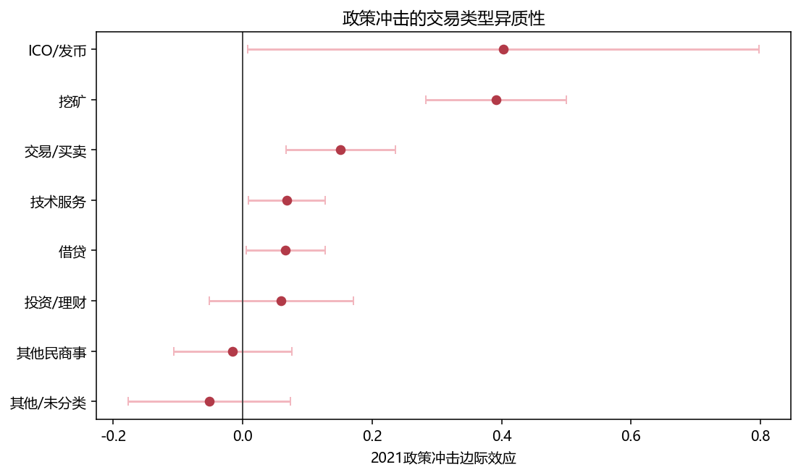
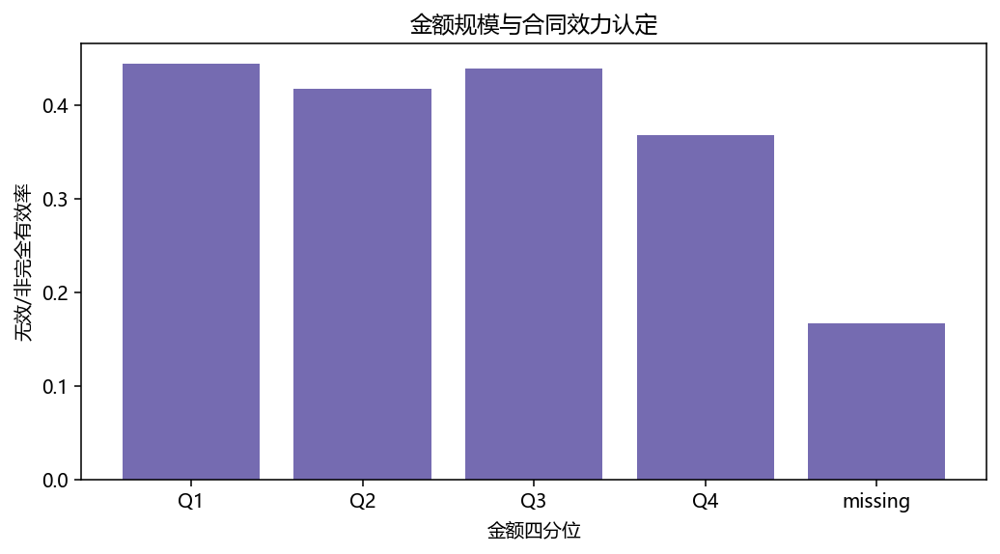
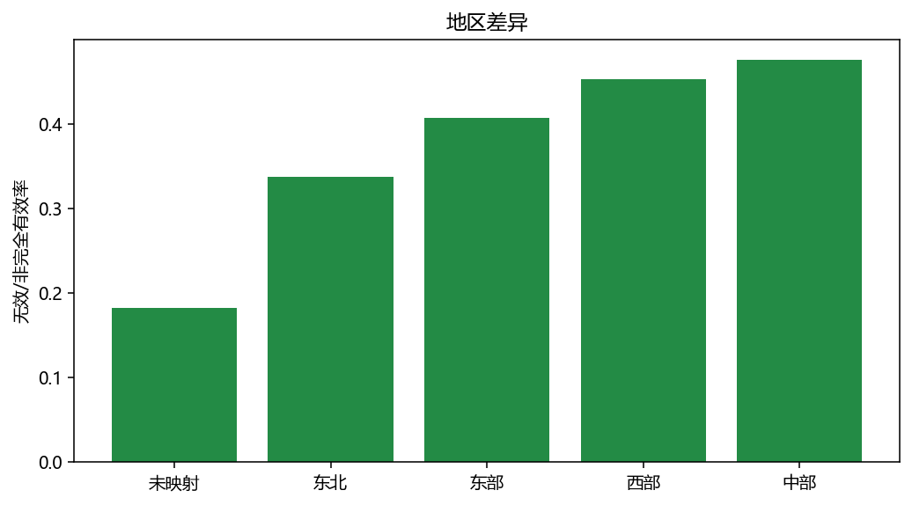
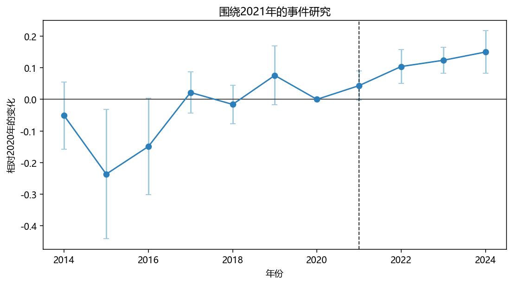

# 虚拟货币管制的司法实践及其货币理据

**Judicial Practice and the Monetary Rationale of Virtual-Currency Regulation**

**内容提要：** 虚拟货币合同效力裁判的关键，不在于抽象确认虚拟货币是否具有财产价值，而在于判断合同法是否正在为私人共识货币秩序提供强制执行力。本文基于12135份虚拟货币相关司法裁判结构化数据，在DeepSeek-V4-Flash-preview标注及1%抽样人工校对基础上，检验政策节点、交易类型、金额规模与地区差异对合同效力认定的影响。结果显示，2021年政策节点与否定性效力认定上升存在稳定关联，交易类型贡献最强解释力，金额与地区主要呈现机制和异质性意义。规范上，监管政策不能直接替代合同效力判断；其进入私法的正当路径，是通过《民法典》第153条第2款中的公序良俗，将受保护的公共秩序具体化为货币秩序。虚拟货币不同于假币，其风险不在僭用人民币符号，而在借助代码、平台、流动性和收益预期形成可交易、可清算、可跨境转移的私人货币秩序。合同法应否定生成、扩张和金融化该秩序的合同安排，同时保留既有利益清算、返还和损害填补的有限空间。

**关键词：** 虚拟货币；合同效力；公序良俗；货币秩序；司法实证；交易类型

**Abstract:** The central question in virtual-currency contract cases is not whether virtual currencies have factual economic value, but whether contract law should lend enforceability to a privately constructed monetary order. Based on a structured dataset of 12,135 judicial decisions, annotated with DeepSeek-V4-Flash-preview and audited through a 1% sample, this article examines the relationship between policy shocks, transaction types, case amounts, regional variation and judicial findings on contract validity. The audited data reach a micro F1 score of 0.7792 and a macro F1 score of 0.8138 after excluding free-text fields. Empirically, the 2021 regulatory turning point is stably associated with a higher probability of invalidity or non-full-validity findings; transaction type provides the strongest explanatory gain; case amount and region mainly reveal mechanisms and heterogeneity. Normatively, regulatory policy cannot by itself determine civil validity. Its legitimate private-law route lies in the public-order clause of Article 153(2) of the Civil Code, with the relevant public order specified as monetary order. Virtual currency is not counterfeit currency: its threat lies not in imitating the renminbi, but in building a tradable, settleable and potentially cross-border private monetary order through code, platforms, liquidity and return expectations. Contract law should deny enforcement to arrangements that generate, expand or financialize that order, while preserving limited relief for restitution, valuation and loss allocation after the fact.

**Keywords:** virtual currency; contract validity; public order; monetary order; empirical legal studies; transaction type

## 一、问题的提出

虚拟货币案件进入民事裁判以后，法院表面上处理的是合同是否有效、损失如何分担、虚拟货币能否返还或折价赔偿等私法问题；实质上，法院面对的是金融监管秩序如何转译为合同效力评价的问题。2013年以来，我国监管规则经历了从风险提示、代币发行融资禁止到虚拟货币交易炒作风险整体治理的阶段性推进。[^reg] 但监管文件并不能自动回答已经进入诉讼的个案如何处理。即使相关业务活动被行政监管否定，法院仍须在《民法典》的合同效力体系内说明：为什么一项已经发生的民事交易应被否定效力，为什么当事人的财产利益让位于更高层级的秩序利益，以及这种否定效力是否存在边界。

既有研究多从虚拟货币的财产属性、数据属性、债权属性或金融资产属性切入。这些讨论当然重要，因为它们决定虚拟货币能否被占有、继承、执行、返还或作为犯罪对象评价。[^property] 但是，对于合同效力裁判而言，更关键的问题并非虚拟货币是否“有价值”，而是特定交易安排是否应获得合同法的强制执行力。换言之，法院不是抽象地保护或排斥一个数字资产，而是在判断某种交易结构是否帮助虚拟货币获得生产、流通、兑换、理财或支付功能。只有把问题推进到这一层，才能解释同样涉及虚拟货币的案件何以在不同交易类型、金额规模和地区环境下呈现差异化结果。

本文的中心论断是：虚拟货币管制在司法实践中呈现出金融公法私法化的过程。2021年以后，法院更频繁地借助公序良俗、金融秩序和监管政策否定虚拟货币相关合同效力，但这种效力否定并非单纯执行行政政策，而是以维护货币秩序为深层理据。虚拟货币不同于假币。假币破坏货币秩序，是因为其僭取国家货币的形式、符号和信用背书；虚拟货币则通常并不冒充人民币，而是以私人共识、代码规则、链上清算和市场流动性构造出一种约定货币秩序，从而挑战国家对货币发行、价值尺度、支付清算、资本流动和金融风险传导的制度控制。[^private-money]

由此，虚拟货币合同效力规则的真正任务，并不是确认虚拟货币是否能够作为财产被保护，而是判断相关合同是否以私法形式承载、扩张或强化了这种私人货币秩序。若合同仅用于已经发生利益移转后的清算、返还或损害赔偿，法院可以有限处理其财产后果；若合同目的在于挖矿、发币、撮合交易、场外兑换、代币理财或收益承诺，则合同法保护本身就可能成为绕开金融管制的制度通道。本文即试图在经验事实与规范理论之间建立连接：先检验司法实践如何处理虚拟货币合同，再追问法院何以能够、也何以应当借助公序良俗维护货币秩序。[^contract-bridge]

## 二、基于LLM的虚拟货币民事案件合同效力实证分析

上一部分已经说明，虚拟货币合同效力问题不能仅以财产属性作答；要判断法院实际保护或排除的究竟是哪一种交易结构，还需要回到大量裁判文本本身。本部分先交代数据来源、字段抽取和质量校验，再说明变量构造、模型设定和主要经验发现，以便为后文的规范论证提供事实基础。

### （一）数据来源与抽取质量

本文使用的经验材料来自虚拟货币相关司法裁判的结构化数据库。原始材料为虚拟货币相关裁判文书及其配套索引信息，经去重、合并和字段标准化后形成12135条结构化记录。由于本文关注合同效力与民商事关系，回归分析以民事主样本为中心，最终得到5170条民事样本记录；在剔除关键变量缺失后，主回归可用样本为5166条，严格因变量稳健性检验样本为5095条。样本年份覆盖2014年至2024年，能够观察2017年、2021年监管节点前后的司法变化。[^data-source]

在数据构建上，本文没有采用单纯人工阅读逐案编码的传统方式，而是在利用DeepSeek-V4-Flash-preview完成主体标注的基础上，对随机抽取的1%样本进行人工校对，并据此评估字段抽取质量。人工校对样本共覆盖26个字段，整体micro precision为0.8134，micro recall为0.7477，micro F1为0.7792；若剔除开放式自由文本字段，macro F1为0.8138。其中，本文最关心的`case_amount`字段F1为0.8493，`contract_validity`字段F1为0.9176，`activity_type`字段F1为0.7500。对法学读者而言，F1值可以理解为“准确率”和“召回率”的平衡指标：前者关心抽取出的内容有多少是对的，后者关心应该被抽取的内容是否被遗漏。上述结果说明，核心结构化字段已经能够支撑经验法学分析；自由文本摘要因天然开放，不作为本文的主要回归变量。大语言模型用于法律文本结构化抽取并非没有风险，但在限定字段、统一提示词、抽样复核与错误评估同时存在时，其方法论地位已经更接近受控标注工具，而非未经验证的自动判断。[^llm]

表1展示了本文核心样本和数据质量指标。

| 指标 | 数值 |
| --- | ---: |
| 全部结构化记录 | 12135 |
| 民事主样本 | 5170 |
| 主回归样本 | 5166 |
| 严格因变量样本 | 5095 |
| 年份范围 | 2014-2024 |
| 民事样本无效或非完全有效率 | 42.48% |
| micro precision | 0.8134 |
| micro recall | 0.7477 |
| micro F1 | 0.7792 |
| macro F1（去掉自由文本） | 0.8138 |
| `case_amount` F1 | 0.8493 |
| `contract_validity` F1 | 0.9176 |

从研究设计上看，上述数据质量指标有三层含义。第一，本文并不把大模型输出直接等同于案件事实，而是把它视为一种结构化标注结果。司法裁判文书本来就是非结构化文本：同一份判决可能在事实部分、争议焦点、法院认为和判决主文中分别提到金额、合同效力、交易类型和法律依据。如果完全依靠人工编码，样本规模将受到显著限制；如果完全依靠自动抽取，错误又可能进入回归。本文采取的折中方案，是先用统一提示词完成全样本抽取，再用随机抽样校对评估抽取质量，并在回归中尽量使用结构清楚、F1较高的字段。

第二，F1值不能简单理解为传统意义上的考试分数。对于法律文本抽取而言，有些字段天然更容易一致，例如法院名称、案号、裁判日期；有些字段则更依赖法律解释，例如合同效力、交易类型、无效原因和司法理由。本文关注的`contract_validity`字段F1达到0.9176，说明合同效力这一核心因变量具有较高可靠性；`case_amount`字段F1为0.8493，说明金额字段已经能够进入实证分析，但仍需通过缩尾、剔除极端值和金额口径替代等方式做稳健性检验；`activity_type`字段F1为0.7500，提示交易类型虽然解释力很强，但内部仍可能存在边界模糊，因而本文在规范分析中没有机械相信单一标签，而是结合交易功能展开解释。

第三，本文的数据质量检验服务于法学论证，而不是替代法学论证。经验研究只能告诉我们，在大量裁判中哪些因素与合同效力认定存在稳定关系；它不能直接回答这些关系是否正当，也不能直接告诉法官在个案中应如何裁判。因此，本文把数据质量、描述统计、主回归、稳健性检验和规范论证分开呈现：先说明数据是否可用，再说明法院实践呈现何种规律，最后回到公序良俗和货币秩序解释为什么这种规律在法教义学上能够成立。

### （二）因变量、自变量与控制变量

本文的主因变量为`contract_invalid`，即法院是否作出合同无效、非完全有效或者实质上不予支持的效力判断。该变量并不把所有涉虚拟货币案件都等同处理，而是聚焦于合同效力后果：如果法院明确否定交易效力，或者虽未使用“无效”二字但在结果上拒绝给予合同法保护，则编码为1；若法院承认合同效力或者在返还、赔偿等层面给予较充分保护，则编码为0。稳健性检验使用更严格的`contract_invalid_strict`，仅根据文本型合同效力字段作更保守分类。[^coding-rule]

核心解释变量是`post2021`，表示裁判年份是否位于2021年及以后。选择2021年并非因为某一单一规则瞬间改变了所有司法裁判，而是因为2021年前后监管体系对虚拟货币交易炒作、挖矿活动和相关金融业务的风险定位明显强化。本文将其视为政策节点变量，而非严格意义上的随机实验处理变量。因此，本文的经验主张是“政策节点与司法效力判断之间存在稳定关联”，而不是“完全识别了政策因果效应”。[^policy-node]

机制变量包括三组。第一，交易类型。本文将虚拟货币相关民商事交易压缩为借贷、投资/理财、交易/买卖、挖矿、技术服务、ICO/发币、其他民商事和其他/未分类。第二，金额规模。本文使用DeepSeek抽取的顶层`case_amount`作为主金额字段，并保留正则金额作为质量对照和稳健性参考；金额进入模型时取对数，以降低极端大额案件对估计的影响。第三，地区差异。本文根据法院名称和案号识别省份，并构造宏观地区、北上广浙标记等地区变量，以观察不同司法环境下政策吸收程度是否存在差异。

此外，模型控制法院层级、案由组别以及金额抽取质量。后者包括LLM金额与正则金额冲突标记等变量，其目的不是讨论金额本身的规范意义，而是防止因文本抽取不确定性影响核心结论。

### （三）模型设定及其含义

多数法学读者对回归模型并不熟悉，因此本文先说明模型所回答的问题。回归并不是在替代法律解释，也不是在告诉我们某一具体案件必然如何裁判。它所做的是：在同时考虑政策节点、交易类型、金额、法院层级、案由和地区等因素后，观察某一因素是否仍然与合同效力否定性认定存在系统关联。若`post2021`系数为0.0838，即可理解为：在其他变量相同或被模型控制的前提下，2021年以后合同无效或非完全有效的概率约上升8.38个百分点。

本文主模型采用线性概率模型。其优点是系数可以直接解释为概率百分点变化，适合法学论文中的结果展示；同时，本文使用Logit模型作为非线性稳健性检验，以防线性概率模型的函数形式影响结论。主模型可简化表示为：[^method]

```text
Invalid_i = α + β Post2021_i + γ Amount_i + θ TransactionType_i
            + ρ Region_i + Controls_i + ε_i
```

其中，`Invalid_i`表示第i个案件是否被法院作出否定性合同效力判断，`Post2021_i`表示2021年以后的政策节点，`Amount_i`表示金额规模，`TransactionType_i`表示交易类型，`Region_i`表示地区变量，`Controls_i`包括法院层级、案由和金额质量控制。所有主回归均按省份聚类标准误。其含义是：同一省份法院可能共享相近的审判环境、地方风险结构和司法政策接受方式，若不对这种聚集性作处理，模型可能高估统计显著性。

金额变量的理论定位尤其需要说明。涉税行政裁判研究已经提示，金额并不只是案件大小，而是法院是否愿意投入更高审查成本的收益代理变量：金额越大，潜在纠错收益、权利保护收益和司法公信收益越高，法院越可能从形式审查走向实质审查。[^amount] 在虚拟货币案件中，金额也有类似含义，但更复杂。它既表示当事人的私人利益强度，也表示交易从个体财产纠纷扩张为规模化金融活动的秩序风险强度。正因如此，金额不宜被简单理解为“数额越大越无效”，而应被理解为衡量风险规模的机制变量；真正决定风险性质的，仍然是交易类型。

为了便于没有定量训练的读者理解，本文还需说明回归表中的几个常见概念。系数表示某一变量与因变量之间的平均关联方向和幅度。以`post2021`系数0.0838为例，它不是说每个2021年后的案件都会增加8.38个百分点的无效概率，而是在控制金额、法院层级、案由等变量后，2021年以后案件相对于2021年前案件的平均否定性效力认定概率更高。标准误衡量估计结果的不确定性；标准误越大，说明同样的系数越不稳定。p值用于判断观察到的系数是否可能来自随机波动；通常p值小于0.05会被称为统计显著，但显著性不是法律重要性的同义词。

R2则表示模型能够解释因变量差异的比例。法学读者不宜把R2理解为“裁判正确率”。裁判结果由大量文本事实、法律依据和价值衡量共同决定，任何模型都不可能完全解释。本文更关心的是R2在不同模型之间如何变化：基准模型R2为0.0999，加入交易类型后上升到0.1667，说明交易类型显著增加了模型对合同效力认定差异的解释力。这一变化比单纯讨论某个p值更有法学意义，因为它表明法院并不是随机地否定合同，也不是只看政策年份，而是在不同交易结构中进行风险识别。

聚类标准误的设置也有法律含义。同一省份的法院可能面对相似的监管环境、地方产业结构、审判资源和案件来源。如果把这些案件都当作完全独立的观察值，模型会低估估计误差。按省份聚类标准误相当于承认同一地区裁判之间可能存在相关性，从而使显著性判断更谨慎。对于法学研究而言，这种谨慎是必要的，因为本文的目标不是制造显著结果，而是在可辩护的经验基础上讨论司法裁判的制度逻辑。

### （四）经验发现：政策节点、交易类型、金额规模、地区差异

在完成变量和模型设定后，经验分析需要回答四个相互关联的问题：政策节点是否改变裁判倾向，交易类型是否解释裁判差异，金额规模是否进入法院的风险衡量，地区差异又在何种意义上影响政策吸收。以下分别展开。

#### （一）2021年政策节点：稳定关联与必要限缩

表2列示了主要规格中的`post2021`结果。

| 模型 | `post2021`系数 | 标准误 | p值 | N | R2 | 说明 |
| --- | ---: | ---: | ---: | ---: | ---: | --- |
| 基准模型 | 0.0838 | 0.0389 | 0.0313 | 5166 | 0.0999 | 控制金额、法院层级、案由 |
| 加入交易类型 | 0.0801 | 0.0301 | 0.0078 | 5166 | 0.1667 | 交易类型进入模型 |
| 加入地区 | 0.0807 | 0.0296 | 0.0064 | 5166 | 0.1693 | 进一步控制宏观地区 |
| 加入线性时间趋势 | -0.0054 | 0.0335 | 0.8725 | 5166 | 0.1731 | 同时控制整体时间趋势 |
| 严格因变量 | 0.0857 | 0.0292 | 0.0034 | 5095 | 0.1723 | 使用更严格合同效力变量 |
| 金额缩尾 | 0.0807 | 0.0296 | 0.0063 | 5166 | 0.1694 | 处理金额极端值 |
| 剔除金额Top1% | 0.0803 | 0.0303 | 0.0080 | 5114 | 0.1683 | 排除极端大额案件 |

结果显示，在基准模型、加入交易类型模型、加入地区模型、严格因变量模型以及金额稳健性处理中，2021年以后法院作出否定性合同效力认定的概率均显著上升，幅度大约为8个百分点。这一发现说明，虚拟货币监管政策并未停留于行政监管层面，而是通过司法裁判进入合同效力评价。法院在2021年以后更倾向于把虚拟货币交易与金融秩序、货币秩序和公序良俗联系起来，从而否定合同的可执行性。

但必须同时看到，加入线性时间趋势后，`post2021`本身不再显著，而年度趋势变量显著为正。这一结果非常重要。它提示我们，2021年节点并非完全独立于长期司法收紧趋势之外。更稳妥的说法不是“2021年政策导致法院必然改变裁判”，而是“2021年政策节点与样本期内法院否定虚拟货币合同效力的整体趋势发生叠合，并在多数核心规格中呈现稳定正向关联”。这一区分对法学论文尤其重要，因为经验发现不能替代规范论证。本文后文所要说明的，正是这种政策吸收为什么能够在合同法内部获得正当化。

换言之，表2展示的是一个稳健但有限的经验事实：在多数规格中，2021年以后否定性效力认定更常见；但2021年并不是从无到有的唯一转折点。早在2013年和2017年，监管部门已经分别提示比特币风险并禁止代币发行融资。2021年的意义在于，它把交易炒作、虚拟货币相关业务活动和挖矿整治放入更系统的治理框架，也使法院在民事裁判中更容易把合同效力问题与金融秩序、货币秩序和公共利益联系起来。因此，本文把2021年称为政策节点，而不是严格实验意义上的处理时间。

这一发现对规范论证的启发在于：法院并不是在2021年以后突然开始“执行政策”，而是在监管不断明确后，逐步把公法上的风险判断转译为私法上的效力判断。若无规范桥梁，这种转译可能被批评为行政政策直接替代合同法；若能证明虚拟货币交易确实触及货币秩序公序，则政策文件就可以作为识别公共秩序内容的重要背景。经验结果说明这种转译已经发生，规范部分则需要回答这种转译应如何被限制和正当化。



#### （二）交易类型：最强解释变量

在所有变量中，交易类型带来的解释力提升最为明显。基准模型R2为0.0999；加入交易类型后，R2提高至0.1667；进一步允许政策节点与交易类型交互后，R2达到0.1773。对法学解释而言，这一结果比单个系数更重要。它说明法院并非抽象地对“虚拟货币”作一刀切处理，而是在不同交易结构中识别风险：挖矿、ICO/发币和交易/买卖更接近虚拟货币生成、流通和市场扩张环节，因而更易被视为与管制目标直接冲突；借贷、技术服务或既有事实清算案件则需要更细致地判断其是否实质支持虚拟货币金融化。[^type-risk]

交易类型交互模型的分组效应进一步印证了这一点。

| 交易类型 | 2021后边际效应 | p值 | 解释 |
| --- | ---: | ---: | --- |
| ICO/发币 | 0.4027 | 0.0459 | 直接扩张私人货币秩序 |
| 挖矿 | 0.3916 | <0.001 | 虚拟货币生成机制前端 |
| 交易/买卖 | 0.1514 | <0.001 | 推动流通和兑换 |
| 技术服务 | 0.0685 | 0.0236 | 需穿透判断服务内容 |
| 借贷 | 0.0660 | 0.0337 | 易与收益安排、融资功能结合 |
| 投资/理财 | 0.0597 | 0.2919 | 类型内部差异较大 |
| 其他民商事 | -0.0154 | 0.7404 | 多为事实清算或边缘纠纷 |
| 其他/未分类 | -0.0514 | 0.4213 | 信息不足，不宜过度解释 |

这一结果能够解释司法实践中的一个核心现象：法院并不是因为虚拟货币“没有财产价值”而否定合同，而是在判断特定合同是否帮助虚拟货币获得生成、流通、兑换、金融化或跨境转移功能。挖矿合同的风险不在于其表面上是算力服务，而在于它提供虚拟货币生成机制；场外交易和买卖合同的风险不在于买卖本身，而在于它使虚拟货币获得兑换和流通基础；投资理财和借币生息合同的风险不在于虚拟货币标的，而在于它把虚拟货币转化为类金融产品。因此，交易类型并不是普通控制变量，而是法院识别货币秩序风险的主要入口。

具体而言，ICO/发币和挖矿的政策节点效应最大，说明法院对虚拟货币“生成端”的敏感度最高。发币和ICO直接创造新的代币权益、募集资金并建立交易预期，最接近私人发行货币或准金融产品的制度风险；挖矿虽然常以设备租赁、算力托管、技术服务等形式出现，但其功能在于维持虚拟货币生产和记账机制。当合同保护这些安排时，法院实际上是在保护虚拟货币体系的供给端和基础设施。因此，这两类交易在政策收紧后出现更强效应，并不令人意外。

交易/买卖的效应也较强，但其逻辑不同。买卖合同本身是民法上最常见、最中性的交易形式，不能因为名称为买卖就当然无效。问题在于，虚拟货币买卖往往承担价格发现、流动性提供和法币兑换功能。如果法院普遍支持场外交易、撮合交易和兑换承诺，虚拟货币就会在国家支付清算体系之外获得稳定流通渠道。由此，交易/买卖类型的高效应说明法院关注的并非买卖形式本身，而是该形式在虚拟货币生态中的货币化功能。

借贷、投资/理财和技术服务则更需要穿透审查。借贷可能只是既有资产返还，也可能演变为借币生息和融资安排；投资/理财可能是普通委托，也可能是以虚拟货币为底层资产的收益承诺；技术服务可能只是软件开发，也可能实质支持挖矿、交易撮合、钱包归集和量化交易。实证结果中这些类型的效应不如挖矿、发币和交易/买卖整齐，恰恰提示规范规则不能只靠合同名称，而应围绕合同功能作具体判断。





#### （三）金额规模：从案件大小到秩序风险强度

金额变量的经验结果更复杂。在省份聚类标准误下，主金额对数在基准模型和加入交易类型后的模型中均未稳定显著；使用LLM金额、正则金额、缩尾金额或剔除金额最高1%样本后，2021政策节点的主结论没有改变。按金额四分位分组后，最高金额四分位案件的2021后边际效应约为0.1441，高于非最高四分位案件的0.0720；但交互项本身未达到通常意义上的统计显著。由此，金额应被谨慎定位为机制变量和异质性线索，而非本文的主轴变量。

这一发现恰好具有规范解释价值。金额不是没有意义，而是其意义不在于直接决定合同效力。高金额提高了两种强度：一是私人利益强度，即合同有效或无效对当事人财产后果的影响更大；二是秩序风险强度，即交易越可能从偶发性财产纠纷转化为规模化投资、融资、兑换或清算活动。但金额只能说明风险规模，不能说明风险性质。同样是高金额案件，如果只是既有虚拟货币的返还或折价赔偿，秩序风险可能有限；如果是挖矿投资、场外兑换、代币理财或借币生息，则金额越大，越说明其对货币秩序和金融监管秩序的冲击更强。因此，金额最适合被放在“交易类型—秩序风险”的机制链条中理解。

金额分析还可以帮助理解法院为何需要在合同效力和后果清算之间作区分。小额案件中，法院可能更倾向于用简化方式处理事实争议；大额案件中，合同无效会带来更大的利益再分配，法院必须面对返还、折价、过错和损失承担问题。若只说“金额越大越无效”，就会误解法院行为：法院并不是因为金额大而惩罚当事人，而是在金额较大时更容易意识到交易背后的组织化、金融化和秩序风险。同时，大额案件也更需要法院防止一方借无效规则获得不当利益，这就是金额变量同时具有公法风险和私法救济两面性的原因。

本文使用对数金额，也是为了处理金额分布高度偏态的问题。虚拟货币案件中少数案件金额极高，如果直接把原始金额放入模型，少数极端值可能支配估计结果。取对数后的含义是，金额从1万元到10万元、从10万元到100万元的变化被视为相似量级的增长，而不是让亿元级案件完全压倒普通案件。缩尾和剔除Top1%样本的稳健性检验进一步说明，本文关于2021政策节点和交易类型的结论并不是少数超大金额案件造成的假象。



#### （四）地区差异：管制执行环境的异质性

地区变量同样不能取代交易类型成为主轴，但能够说明司法转化的环境差异。模型显示，北上广浙地区本身与较低的否定性效力认定概率相关；但按组分解后，北上广浙地区的2021后边际效应为0.1229，非北上广浙地区为0.0611。由于交互项未稳定显著，该结果不宜被解释为地区因果效应。更稳妥的理解是：经济发达地区、虚拟货币交易活跃地区或审判资源更集中的地区，可能更早、更集中地面对虚拟货币交易组织、场外兑换、技术服务和跨境支付等复杂类型，因而在政策吸收上呈现不同节奏。

这种地区差异提醒我们，虚拟货币管制虽然是全国统一的金融政策，但其司法实现仍会受到地方案件结构、产业风险暴露、法院层级和审判经验的影响。法学规范分析不能把司法实践想象为政策文本的机械复制，而应看到政策在个案裁判中要经过案由、合同类型、金额规模、法院层级和地方风险环境的共同过滤。

地区差异还有一个更深层的解释：虚拟货币交易本身并不是均匀分布的。经济发达地区可能更早接触交易平台、技术服务、场外兑换和跨境支付，部分资源型地区则可能在挖矿活动中暴露更高风险。法院面对的案件类型不同，裁判语言和效力判断也可能不同。因此，地区变量不能被简单理解为某一地区法院更严或更宽，而应理解为地方风险结构、案件输入结构和审判经验共同作用的结果。本文采用北上广浙和宏观地区变量，只是对这种复杂差异的初步刻画，不能替代后续更细的地区监管强度研究。

从规范角度看，地区差异提醒我们统一裁判规则并不等于消除所有差异。真正需要统一的是判断框架：法院应围绕合同功能、秩序风险和后果清算展开论证；至于不同地区因为案件类型、金额结构和交易场景不同而形成的结果差异，只要其理由结构一致，就未必构成不当差别。反之，如果同一类交易在不同地区被简单以“虚拟货币有价值”或“政策禁止”作相反处理，才是真正需要通过司法解释、指导案例或类案检索机制加以纠偏的问题。



#### （五）事件研究与稳健性：经验发现的边界

事件研究以2020年作为基准年，观察2021年前后各年份相对于2020年的变化。图6显示，2021年以后否定性合同效力认定整体上升，但这一上升并非孤立的单点跳跃，而是与样本期内裁判趋势共同展开。这与加入线性时间趋势后的结果一致：政策节点很重要，但不能被过度表述为严格因果识别。



本文还进行了若干稳健性检验：其一，使用严格因变量后，`post2021`系数仍为0.0857，显著为正；其二，使用LLM金额、正则金额、缩尾金额或剔除金额最高1%的样本后，政策节点结果基本保持；其三，逐一剔除样本量较大的省份，`post2021`系数仍保持正向，说明结论不是由某一个大省样本驱动；其四，Logit模型作为非线性稳健性检验，得到的方向性结论与线性概率模型一致。

这些结果共同指向一个经验判断：2021年前后，法院对虚拟货币合同效力的否定性认定确实更强，但真正解释裁判差异的，不是时间本身，而是政策节点如何与交易类型、金额规模和地区环境共同作用。经验结果因此支持本文的规范命题：法院实际关注的不是抽象的“虚拟货币财产性”，而是合同是否承载私人货币秩序的生产、扩张和金融化功能。


还需要说明的是，本文的实证分析并不试图把复杂裁判化约为一个统计公式。法律裁判包含事实认定、规范选择、价值衡量和裁判后果安排，任何回归模型都不可能替代法官对个案的法律判断。回归模型的作用更有限，也更明确：它帮助我们观察在大量案件中是否存在肉眼不易把握的系统性模式。比如，单独阅读若干案件时，我们可能会把合同无效理解为某一法院、某一法官或某一当事人争议结构的偶然结果；但当数千份裁判同时显示2021年后否定性效力认定上升、交易类型显著改变模型解释力时，研究者就有理由追问：这种变化背后是否存在统一的制度逻辑。本文将这一制度逻辑概括为“货币秩序公序”，正是从经验事实回到法教义学解释的结果。

同时，本文也不把F1值较高理解为数据完全无误。法律文本中的金额、合同效力、交易类型和裁判理由常常以非标准语言出现，同一判决还可能同时包含合同、侵权、不当得利、刑事追赃和执行处置等多重语境。大模型抽取的价值在于提高结构化效率，但其结论只有在抽样校对、字段限定和稳健性检验之后，才具有经验研究意义。因此，本文在解释结果时采取三项限制：第一，只把`case_amount`、`contract_validity`、`activity_type`等质量相对可控的结构化字段作为核心变量；第二，对开放式摘要不作主要回归依据；第三，对于政策节点和地区差异均使用“关联”“趋势”“异质性”等表述，而不把统计相关直接写成严格因果。这样的限制并不会削弱论文结论，反而使结论更符合法学研究对规范论证和事实基础之间关系的要求。

从法学写作角度看，本文的实证部分承担的是“问题发现”和“机制筛选”功能。它证明虚拟货币合同效力裁判并非完全零散，也并非简单随着监管政策机械改变；它显示法院较稳定地把不同交易类型置于不同风险层级之中，并在金额和地区变量上体现出更复杂的边界意识。接下来的规范讨论，正是在这一基础上展开：如果法院并非抽象否定虚拟货币，而是主要否定那些帮助虚拟货币获得生产、流通、兑换和金融化功能的合同，那么合同效力规则就应当从“虚拟货币是否为财产”的单一问题，转向“合同是否保护私人货币秩序”的功能判断。

## 三、金融公法透过货币公序调整合同效力的规范理据

实证结果显示，法院并非随机处理涉虚拟货币合同，而是围绕政策节点、交易类型、金额规模和地区环境形成了较稳定的裁判模式。但统计关联本身不能回答效力否定为何正当。要使经验发现进入法学论证，还必须说明金融监管如何在合同法内部获得规范入口，以及该入口为何应被限定为货币秩序公序。

### （一）货币秩序作为公序的规范入口

虚拟货币管制首先是金融公法问题。监管文件针对的是交易炒作、非法金融活动、挖矿整治、支付结算风险、跨境资金流动风险和投资者风险。但民事法院面对的不是行政处罚或监管许可，而是合同效力、返还责任、损失分担和违约责任。公法监管与私法后果之间需要一个转换装置。这个转换装置，就是公序良俗。[^civil]

这里的法教义学难题在于，《民法典》第153条第2款并没有把任何违反监管政策的合同都当然置于无效之列。公序良俗条款是一种开放条款，但开放并不等于无边界。法院不能只说“监管文件禁止虚拟货币交易”，就径直推出合同无效；也不能只说“虚拟货币具有财产利益”，就径直推出合同有效。前一种推理会把行政监管文件变成合同效力的直接渊源，弱化民法内部的规范判断；后一种推理则把事实价值误认为可执行性，忽略合同法保护本身可能造成的制度外部性。真正需要完成的论证，是把公共秩序的内容、合同损害该秩序的方式以及效力否定的必要范围逐一说清。

如果将公序良俗理解为一个空洞口袋，法院就容易在“政策禁止”与“合同无效”之间作过快跳跃。本文认为，虚拟货币案件中的公序不应泛称为“金融秩序”或“经济秩序”，而应进一步具体化为“货币秩序”。金融秩序范围过宽，几乎可以容纳任何监管目标；经济秩序更加宽泛，容易把价格波动、投资风险和监管不便利都纳入合同无效理由。货币秩序则更能解释为什么某些虚拟货币合同即使当事人自愿、标的具有经济价值、交易形式上完成，也仍然不宜获得合同法强制保护：问题不在于当事人能否处分自身财产，而在于他们所约定的合同结构是否使一种非国家信用支持的价值媒介获得稳定生产、定价、流通、清算和风险传导能力。

货币秩序不是简单的纸币发行秩序，而是国家围绕法偿性、支付清算、金融机构、反洗钱、外汇管理和资本流动所形成的一整套制度结构。现代货币不是纯粹市场自发秩序，而是国家信用、金融基础设施和法律强制共同构成的制度结果。[^money] 虚拟货币之所以触发强监管，并不是因为其价格波动或投机属性本身，而是因为其在特定网络中能够承担价值尺度、交换媒介、支付工具、资产储藏和跨境转移功能。当这些功能被合同结构稳定化、规模化和金融化时，合同法保护就不再只是保护个别当事人的财产期待，而是在为一种私人共识货币秩序提供可执行性。

货币秩序至少包含四个相互扣合的层面。第一是价值尺度层面，即社会成员在何种单位中衡量给付、债务和损失；第二是支付清算层面，即债务如何完成清偿、资金如何结算、交易如何终局化；第三是信用创造和金融中介层面，即价值媒介能否被包装为收益承诺、融资工具或杠杆安排；第四是资本流动和风险治理层面，即价值能否绕开法定支付和外汇管理渠道进行跨境转移、匿名归集或大规模投机。虚拟货币案件中的许多合同之所以敏感，正是因为它们分别占据这些层面：场外买卖提供定价和兑换，挖矿提供生成机制，发币和ICO提供发行及募资，借币生息和委托理财提供收益化包装，稳定币支付和链上转移则可能提供跨境清算通道。

这一点也能说明虚拟货币与假币的根本区别。假币破坏货币秩序，是因为它伪装成法定货币，僭取国家信用并混淆真币与伪币。虚拟货币通常并不冒充人民币，它的风险在于另起炉灶：通过代码规则、稀缺性叙事、链上转移、交易平台和市场预期构成一种不依赖国家信用的约定货币秩序。前者是伪国家货币，后者是私人共识货币。正因为如此，虚拟货币不必被认定为假币，也仍可能触及货币秩序公序。合同效力裁判的关键并不是问“它是不是货币”，而是问“合同法是否正在保护其货币化功能”。[^counterfeit]

这种区分也澄清了“虚拟货币不是法定货币”与“虚拟货币合同无效”之间的关系。前一判断只是说明虚拟货币不得作为法偿货币流通，不能替代人民币履行一般支付职能；后一判断则是合同法上的效力后果，需要进一步说明具体合同如何支持其货币化功能。二者之间不能直接画等号。某些案件只是围绕既有占有、损害、返还或折价展开，并不继续扩张虚拟货币的生成和流通功能；另一些案件虽然外观上是买卖、借贷、服务或委托，却实质上以虚拟货币为收益载体、支付媒介或融资工具。只有后一类合同，才真正触及货币秩序公序的核心。

由此，监管政策进入合同法并非简单的公法压倒私法，而是公序良俗条款对货币秩序的私法表达。法院不能以监管文件替代法律判断，但可以在确认合同安排实质损害货币秩序时，将监管政策作为识别公序内容的重要依据。换言之，监管文件提供的是秩序风险的制度背景，公序良俗提供的是合同法内部的效力入口，货币秩序则提供了二者之间的规范桥梁。

这一规范桥梁还可以避免两个相反误区。第一个误区是“政策替代说”，即只要行政监管文件禁止某类活动，民事合同就当然无效。该说法虽然能够快速得出裁判结论，却削弱了合同法自身的论证结构，也容易使法院在个案中忽视返还、折价、损失分担和不当得利等后果规则。第二个误区是“财产保护说”，即只要虚拟货币具有事实价值或可被控制，就应当尽量承认相关合同效力。该说法能够回应当事人的个体财产期待，却没有充分解释虚拟货币交易为何可能从个体交易扩张为支付、清算、融资和跨境转移秩序。本文主张的货币秩序公序，正是试图在二者之间取得更准确的裁判焦点：行政监管不能自动替代私法判断，但虚拟货币的事实价值也不能自动推出合同可执行性。

因此，公序良俗在本文中的作用不是扩大法官自由裁量，而是压缩裁量的不确定性。法院适用公序良俗时，应当具体说明被保护的公共秩序是什么、合同结构如何损害该秩序、效力否定是否超出必要范围、否定后是否仍需处理既有财产后果。对于虚拟货币案件而言，这四个问题可以依次转换为：相关秩序是否为货币秩序；合同是否支持虚拟货币的生产、流通、兑换、支付或金融化；否定效力是否只是阻断继续履行与收益期待，还是过度排除了返还和损害填补；裁判后果是否会反向鼓励违约方、侵权方或不当得利方保有利益。只有经过这样的分层论证，公序良俗才不会沦为“监管政策加盖私法印章”的简单工具。

更进一步说，货币公序不是一个单纯防御性概念，而是合同法在货币主权、金融安全和个体财产保护之间进行制度分配的概念。国家不需要否认虚拟货币的事实价格，才能否定相关合同的履行利益；法院也不需要承认虚拟货币具有法定货币地位，才能处理已经发生的返还和损害填补。二者之间的关键，是区分“价格事实”和“法律背书”。市场价格只是事实层面的交换信息，合同强制执行则是国家司法机关对某种交易结构的制度承认。虚拟货币案件的困难，正发生在二者容易被混同之处：若法院支持继续履行、收益承诺或按投机价格补足差额，就可能把价格事实转化为法律背书；若法院拒绝一切返还和清算，又可能放任一方保有不当利益。货币公序的意义，正在于把这两种后果分开。

## 四、虚拟货币全面管制与类推外汇制度的可能性探讨

如果说第三部分解决的是监管政策如何进入合同法，那么本部分进一步处理制度边界问题：全面管制何以仍有必要，外汇制度能在何种范围内提供参照，以及合同效力规则如何在禁止交易扩张与处理既有财产后果之间取得平衡。

### （一）整体禁止令的货币理据

基于上述规范机制，整体禁止令仍具有必要性。原因不在于虚拟货币毫无价值，也不在于任何持有、返还或损害赔偿请求都应被否定，而在于虚拟货币交易活动之间具有链条关系。挖矿、发币、交易撮合、场外兑换、代币理财、借币生息、跨境稳定币支付等活动并非彼此孤立；前端生产、中心流通和后端金融化可以相互支撑。如果司法在个案中普遍承认这些合同可执行性，整体禁止令就可能被私法结构逐步掏空。[^mining-chain]

全面管制的正当性，首先来自虚拟货币生态的网络效应。单独观察某一份买卖合同、算力托管合同或委托投资合同，似乎只是两个当事人之间的财产安排；放入整体链条中看，它们分别为同一套私人货币秩序提供供给、流动性、价格发现、收益预期和退出通道。挖矿没有流通市场，收益预期就难以成立；交易市场没有法币兑换和场外撮合，流动性就难以维持；理财和借币生息没有价格上涨和可退出渠道，收益承诺就只是空壳。因此，监管采取整体禁止而非逐项许可，并非因为无法区分具体交易，而是因为这些交易在功能上具有互补性，任何一个环节被合同法稳定保护，都可能反向支撑其他环节。

这也解释了为什么交易类型比金额更重要。金额反映风险强度，但交易类型决定风险性质。挖矿和ICO/发币之所以在政策节点后呈现更强效应，是因为它们直接触及私人货币秩序的生成；交易/买卖和场外兑换之所以敏感，是因为它们提供流动性和价格发现；投资理财和借币生息之所以需要从严，是因为它们把虚拟货币转化为类金融收益安排。与此相对，既有事实的返还、损害赔偿、不当得利返还或执行程序中的价值处理，虽然涉及虚拟货币，却未必继续扩张其货币功能。

从合同法角度看，整体禁止令针对的不是全部财产后果，而是“可执行的交易秩序”。合同效力规则的特殊之处在于，它不仅确认过去已经发生的事实，还能够为未来履行提供国家强制力。若法院支持挖矿合同继续履行，就等于支持虚拟货币继续生成；若支持发币协议、代币认购协议或收益承诺，就等于支持私人发行和融资安排；若支持场外兑换协议按约履行，就等于支持虚拟货币与法币之间的持续兑换渠道。全面管制要阻断的正是这种通过合同强制执行形成的制度化预期，而不是把所有已经发生的财产事实从法律世界中抹去。

因此，整体禁止令的正当性应当被限定在“防止私人货币秩序获得制度化扩张”这一目标上。若把所有涉虚拟货币财产后果都纳入绝对否定，可能导致不当得利、损失无人承担、刑民交叉处置困难等问题；若过度承认交易自由，又会使合同法成为规避金融管制的通道。合理路径不是在“全面放开”与“完全拒绝救济”之间二选一，而是在维持整体禁止的同时，区分交易扩张型合同与事实清算型纠纷。

这一限定也关系到合同无效后果的精细化处理。合同无效并不等于事实关系消失，更不等于法院可以拒绝处理一切财产后果。《民法典》第157条已经为无效合同后的返还、折价补偿和过错责任提供了基本框架。涉虚拟货币案件的特殊性在于，返还或折价补偿本身可能产生两种不同效果：一种是恢复既有利益平衡，避免一方因违法或违背公序的交易获得净利益；另一种则可能在事实上确认虚拟货币的交换媒介、投资标的或收益工具功能。法院需要避免后一种效果，但不能因此放弃前一种必要清算。换言之，禁止令否定的是虚拟货币交易秩序的继续扩张，而不是让所有已经发生的利益移转都停留在无规则状态。

在这个意义上，虚拟货币合同效力裁判应当区分“履行利益”和“清算利益”。对于发币、挖矿、交易撮合、委托理财和收益承诺等交易扩张型合同，当事人请求继续履行、支付约定收益、交付新增代币或按投机价格补足收益的，原则上不应支持，因为这些请求会直接保护私人货币秩序的延续。对于已经发生的转账、占有、返还障碍或侵权损害，法院则可以在不承认虚拟货币法定货币地位的前提下，通过折价、过错比例和不当得利规则完成有限清算。如此处理既保留禁止令的制度强度，也避免因绝对否定而让违反诚信或侵害他人利益的一方获得额外好处。

履行利益与清算利益的区分，还可以避免“无效即不保护”的粗糙表达。合同无效的直接效果，是否定当事人基于有效合同所主张的履行请求、违约利益和期待利益；但无效后的返还、折价和过错责任，是法律为处理既有事实而设定的后果规则。虚拟货币案件中，法院尤其应避免两种裁判语言：一种是以“虚拟货币不具有法偿性”否定一切返还和赔偿，另一种是以“虚拟货币具有财产属性”支持收益承诺和继续交易。前者忽视无效合同后果法，后者忽视货币公序。更准确的表达应当是：虚拟货币交易扩张型合同不受履行保护，但既有利益失衡可以依法清算。

### （二）有限协调：外汇制度的极例参照与司法处置接口

外汇制度为虚拟货币治理提供的启发，不是合法化，而是边界化。外汇是他国主权货币，并非私人共识货币；国家承认其价值，并不意味着放任其自由冲击本币秩序。外汇管理通过兑换许可、结售汇规则、跨境支付、资本项目管理和反洗钱审查划定本币秩序与外部价值秩序之间的制度边界。[^fx] 虚拟货币不能当然类比外汇，因为其背后没有主权信用和国际法意义上的货币发行权。但二者都涉及本国货币秩序与外部价值秩序之间的转换，因此外汇制度可以作为极有限的思维参照。

必须强调，这里的类比只能是制度功能上的类比，而不是法律地位上的类比。外汇之所以能够被纳入兑换、结算和管理体系，是因为其背后存在外国主权信用、国际支付体系和国家间承认结构；虚拟货币并不具备这一基础，不能借外汇制度取得类似合法流通地位。可以类比的，只是外汇制度处理“外部价值单位进入本国货币秩序”时所采取的边界思维：承认某种外部价值事实，并不等于放弃本币秩序控制；允许特定场景下的价值换算和处置，也不等于允许自由交易和支付替代。

这一参照的意义在于：即使面对被法律承认的外国货币，国家也不会放弃本币秩序的边界控制；面对没有主权背书的私人共识货币，更有理由维持严格禁止。但在已经发生的纠纷中，司法仍需处理返还、折价、损害赔偿、执行和刑事追缴等财产后果。此时的制度问题，不是承认虚拟货币自由流通，而是如何在不鼓励交易扩张的前提下完成必要的清算。

换言之，外汇制度提供的不是“虚拟货币可以像外汇一样管理”的结论，而是一个反向论证：即便是具有主权背书的外币，也必须经过国家设定的兑换、结算和资本项目管理边界；那么，缺乏主权背书、匿名性更强、可跨境流转更便捷、价格波动更剧烈的虚拟货币，更不能通过私人合同获得事实上的自由兑换地位。外汇类比的价值，正在于说明货币秩序不是单纯依赖禁止性口号维系，而是依赖制度接口维系。没有接口，司法处置会陷入无规则；接口过宽，又会变相形成交易市场。

因此，可以设想一种极有限的司法处置接口：由特定机构负责涉案虚拟资产的安全保管、链上追踪、估值核验和必要变现，由特定场域或合规通道处理跨境、执行或退赔所需的价值实现。其目的不是形成普通交易市场，也不是为虚拟货币赋予货币地位，而是防止当事人或办案机关在缺乏规则的状态下任意处置资产。刑事涉案虚拟资产处置、执行程序估值和被害人退赔均已显示出专门化制度供给的必要性。[^dispose]

这种接口应当受到三重限制。第一，主体限制。处置不应由普通市场主体自由开展，而应由司法机关、行政机关委托的专门机构或经授权的合规平台在个案中完成。第二，目的限制。处置只能服务于退赔、执行、返还、折价补偿、刑事追缴和资产保全，不能服务于投资、套利、流通或融资。第三，价格限制。估值可以参考多源市场价格、成交记录和链上数据，但判决理由应避免把高波动投机价格直接转化为当然损失，尤其不能支持约定收益、预期涨幅或杠杆收益。只有在这三重限制下，司法处置接口才不会蜕变为事实交易接口。

这一路径也可以回应民事裁判中的难题。若法院一概否定返还或赔偿，可能使违约方、侵权方或不当得利方获得事实利益；若法院完全承认原合同效力，又可能鼓励交易扩张。较为合理的做法是把救济目标限定在“消除既有利益失衡”而非“保护继续交易期待”。因此，法院可以在不承认虚拟货币法定货币地位、不鼓励其流通、不支持收益承诺的前提下，有限处理既有资产的返还、折价和责任分担。

在民事程序中，这种有限协调还应处理证明责任问题。主张返还或折价的一方，应证明虚拟货币的来源、控制关系、转移路径和对方占有或获益事实；主张损害赔偿的一方，还应证明损失与对方行为之间的因果关系。法院不能仅凭交易所截图、聊天记录中的报价或当事人单方陈述认定金额，也不能因为虚拟货币交易被禁止就免除占有方、受领方或管理方的说明义务。证明规则越细，越能把有限清算与交易承认区分开来。

### （三）合同效力规则的重构：从“是否保护虚拟货币”到“是否保护私人货币秩序”

基于经验发现和规范分析，虚拟货币合同效力规则可重构为四个层次。[^typology]

第一，直接构造私人货币秩序的合同，原则上应认定无效。包括发币、ICO、挖矿、交易撮合、做市、场外兑换、稳定币跨境支付等。此类合同不是普通财产交易，而是在生成、维持或扩张虚拟货币的供给、流通和兑换基础。合同法一旦为其提供强制执行力，就会使监管禁止对象获得私法保护。

这一层次的裁判理由应当直接指向货币秩序，而不宜停留在“投资风险自担”或“违反监管政策”的表述上。投资风险自担只能解释当事人为何不能要求国家补偿投资损失，不能充分解释合同为何无效；违反监管政策则只是提示秩序风险，并非完整的民法论证。法院应进一步说明：该合同保护的不是既有财产清算，而是虚拟货币生成、发行、兑换或跨境清算机制；支持其履行会使当事人通过民事判决获得监管体系所禁止的交易通道。因此，无效的对象应主要是继续履行、收益分配、平台服务费、发行收益、撮合佣金和兑换差价等履行利益。

第二，推动虚拟货币金融化的合同，应从严否定。包括代投、委托理财、收益承诺、借币生息、杠杆交易和以虚拟货币为基础的融资安排。这些合同表面上可能是借贷、委托、服务或投资合同，实质上却把虚拟货币转化为类金融产品。即使当事人意思自治真实，也不能当然获得合同保护，因为其损害的不只是个体交易安全，而是金融监管和货币秩序。

这一层次的难点在于，它往往披着民法典型合同的外衣。借币生息可能被写成借贷，代客炒币可能被写成委托，矿机托管可能被写成服务，稳定币搬砖可能被写成合作投资。裁判不能被合同名称牵引，而要审查收益来源和风险承担结构：收益是否来自虚拟货币价格波动、发行溢价、交易撮合、跨境价差或新增代币；受托人是否承诺固定收益、保本收益或按比例分成；资金或币种是否进入平台、矿池、钱包归集地址或境外交易账户。若答案为肯定，合同就不再是普通财产管理，而是将虚拟货币嵌入金融化收益链条。此时否定效力并非惩罚投资失败，而是阻断未经许可的类金融业务借私法获得可执行性。

第三，事实清算型纠纷，应保留有限救济空间。包括既有虚拟货币返还、不当得利、侵权损害赔偿、夫妻共同财产分割、破产或执行程序中的价值确认等。此类案件的重点不是鼓励虚拟货币继续交易，而是处理已经发生的利益移转和责任分配。法院可以通过折价、返还、损害赔偿或不当得利规则完成有限救济，但应避免在判决理由中强化虚拟货币的支付工具或投资标的属性。

事实清算型纠纷的裁判理由应特别克制。法院可以承认当事人之间存在可被清算的利益状态，但不应把这种清算表述为对虚拟货币自由交易的承认。例如，保管人擅自转移他人钱包资产，问题首先是占有、控制和返还障碍；一方收取对价后拒不交付，问题可以是不当得利或损害填补；夫妻共同财产、继承或执行程序中涉及虚拟资产，问题是既有价值如何归集、估算和分配。此类裁判保护的不是虚拟货币作为支付工具的功能，而是法律对既有利益失衡的矫正。判决主文可以采用返还原物、折价补偿、损失分担或不当得利返还等方式，但理由部分应说明救济限于清算，不产生交易合法化效果。

第四，中性技术服务合同，应进行穿透审查。法院不应仅依据合同名称判断效力。若所谓技术服务实质上支持挖矿、交易撮合、资金归集、兑换通道、量化交易或代币理财，就应纳入禁止令覆盖范围；若确属一般软件开发、系统维护或信息服务，且未实质促进虚拟货币交易扩张，可谨慎保留效力空间。本文实证结果中技术服务类型的政策节点效应较小，也提示法院在此类案件中确有必要区分中性技术与交易组织。

技术服务的穿透审查，应同时考察服务对象、服务内容和收费方式。若服务对象是矿场、交易所、量化团队、钱包归集系统或场外兑换团伙，服务内容涉及算力部署、撮合接口、交易策略、资金归集、KYC规避、跨境转移或收益分配，收费又与币价、交易量、挖矿产出或收益比例挂钩，则所谓技术服务已经实质嵌入虚拟货币交易秩序。相反，如果服务内容只是一般软件开发、服务器维护、数据安全或非交易性咨询，且与虚拟货币生产和流通没有直接功能联系，就不宜仅因服务对象曾涉及虚拟货币而当然否定合同。技术中立不是免死金牌，但也不能被过度消解；关键仍在于技术是否成为被禁止交易结构的必要组成部分。

为使上述四分法能够进入裁判操作，法院可以采用三步审查。第一步是识别合同功能，而不是停留在合同名称。买卖、借贷、委托、服务、合伙等民法名称本身并不能决定效力，关键在于合同是否把虚拟货币作为支付工具、兑换媒介、收益载体或融资基础。第二步是判断秩序风险的方向。若合同保护将导致虚拟货币继续获得生成、流通、撮合、兑换和金融化条件，就应倾向于否定履行利益；若合同处理的只是已经发生的占有、转移、损害或不当得利，则应进入清算后果判断。第三步是配置无效后的责任。即使合同因违背公序良俗而无效，法院仍应区分双方过错、风险明知程度、资金流向、实际获益和损失防止可能性，避免简单以“虚拟货币不受保护”为由免除一方返还或赔偿责任。

这三步审查还应对应三类裁判表达。第一，在效力认定部分，法院应明确说明合同损害的具体公序是货币秩序，而非笼统引用“社会公共利益”。第二，在法律后果部分，法院应区分履行利益、信赖利益和清算利益：履行利益原则上不支持，信赖利益视当事人过错和风险认知酌定，清算利益则根据占有、受领、获益和损失情况处理。第三，在金额认定部分，法院应避免简单以最高市场价格确定损失，也不宜完全拒绝估值；较妥当的路径，是结合交易发生时点、实际支付对价、可核验链上记录、多源价格和当事人过错确定折价范围。这样才能使金额分析服务于责任分配，而不是反向确认投机收益。

这一操作路径还可以回应实务中常见的“同案不同判”问题。表面上看，不同法院有时对虚拟货币返还、折价赔偿和合同无效采取不同态度；但若把合同功能拆开，就会发现许多差异并非真正冲突，而是案件处于不同秩序环节。对于发币融资、挖矿投资、场外兑换和委托理财，否定合同效力具有较强一致性；对于保管返还、侵权损害、夫妻共同财产分割和执行估值，裁判分歧更多来自清算方法和估值接口不足。未来司法解释或指导案例若要统一规则，也不宜只给出“有效”或“无效”的抽象答案，而应围绕合同功能、秩序风险和后果清算建立更细的判断清单。

还应注意，本文所说的有限救济不是对虚拟货币交易的变相承认。有限救济的目标，是阻断违法交易后的利益固化，恢复当事人之间最低限度的财产平衡；其依据是无效合同、不当得利、侵权责任或执行程序中的清算规则，而不是承认虚拟货币可以作为一般等价物自由流通。只要法院在判决理由中明确这一点，有限救济与整体禁止并不矛盾。相反，若因担心“承认价值”而拒绝一切清算，反而可能让违背监管政策的一方保有不当收益，削弱司法对秩序风险的实际控制。

这一规则重构的核心，是把裁判问题从“虚拟货币是否应受保护”转化为“合同法是否正在保护私人货币秩序”。前一问题容易陷入财产属性之争，后一问题则能够同时解释政策冲击、交易类型和金额规模：政策节点说明管制如何进入司法；交易类型说明法院实际识别的是合同对虚拟货币秩序的支撑程度；金额说明案件从私人财产纠纷上升为秩序风险的强度；地区差异则说明这种司法转化仍受地方风险结构和审判环境影响。

## 五、结论

虚拟货币合同效力裁判并不是普通合同法问题。它展现的是金融公法如何通过公序良俗进入私法，并将监管政策转化为合同无效判断。本文基于12135份结构化裁判记录和5170份民事主样本发现，2021年政策节点与否定性合同效力认定上升存在稳定关联；交易类型具有最强解释力；金额规模和地区差异具有机制和异质性意义，但不宜成为唯一主线。

规范上，虚拟货币合同之所以可能被否定效力，并非因为虚拟货币没有经济价值，也不是因为所有相关交易当然违法，而是因为部分合同安排帮助虚拟货币形成、扩张或金融化为私人共识货币秩序。国家维护货币秩序的对象，不只是纸币发行权，也包括价值尺度、支付基础设施、清算通道、资本流动和金融风险传导的制度控制。公序良俗在此处的真正功能，是为货币秩序提供私法入口。

未来司法规则不应继续停留在“是否承认虚拟货币财产属性”的抽象争论，而应区分合同的秩序功能：直接构造私人货币秩序者原则无效，推动金融化者从严否定，事实清算型纠纷有限救济，中性技术服务穿透审查。只有在这一类型化框架中，法院才能同时避免以合同自由掏空监管禁止，也避免因绝对否定而制造新的利益失衡。虚拟货币管制的司法实践，最终指向的不是对数字资产的简单排斥，而是对货币秩序边界的私法维护。

[^reg]: 参见中国人民银行等五部门：《关于防范比特币风险的通知》（银发〔2013〕289号，2013年12月3日）；中国人民银行等七部门：《关于防范代币发行融资风险的公告》（2017年9月4日）；中国人民银行等十部门：《关于进一步防范和处置虚拟货币交易炒作风险的通知》（2021年9月15日）。关于合同效力中公序良俗的规范入口，参见《中华人民共和国民法典》第153条、第157条。

[^property]: 关于虚拟货币法律属性和财产保护的不同路径，参见杨东、陈哲立：《虚拟货币立法：日本经验与对中国的启示》，载《证券市场导报》2018年第2期，第76-77页；齐爱民、张哲：《政策与司法背景下虚拟货币法律属性的实证分析》，载《求是学刊》2022年第2期，第113-117页；许多奇、蔡奇翰：《我国加密货币财产属性的司法认定——以金融法与民商法的二维区分为视角》，载《上海政法学院学报（法治论丛）》2021年第6期，第98-99页；杨延超：《论数字货币的法律属性》，载《中国社会科学》2020年第1期，第100-102页；赵磊：《数字货币的私法意义——从东京地方裁判所2014年（ワ）第33320号判决谈起》，载《北京理工大学学报（社会科学版）》2020年第6期，第115-117页；李敏：《数字货币的属性界定：法律和会计交叉研究的视角》，载《法学评论》2021年第2期，第118-120页；吕睿智：《数字货币的交易功能及法律属性》，载《法律科学（西北政法大学学报）》2022年第5期，第73-76页。

[^private-money]: 关于比特币的点对点现金设想，参见Satoshi Nakamoto, *Bitcoin: A Peer-to-Peer Electronic Cash System*, Social Science Research Network, 2008。关于区块链交易验证、共识机制和去中心化记账的基础介绍，参见凌力：《解构区块链》，清华大学出版社2019年版，第120-170页。关于货币非国家化理念及其与比特币的关系，参见盛松成：《货币非国家化理念与比特币的乌托邦》。

[^contract-bridge]: 合同效力否定的规范基础仍应回到《民法典》第153条第2款、第157条以及合同法上返还、折价补偿、损失分担等后果规则。关于涉虚拟货币合同效力裁判中利益衡量路径，参见杨巍：《利益衡量视角下涉虚拟货币合同效力认定的困境及其纾解》；柯达：《虚拟货币“禁止式”监管：法理反思与制度优化》，载《华东政法大学学报》2024年第3期，第140-144页。

[^data-source]: 本文实证部分使用的处理后数据、回归表和图形，保存于“newstudy/result/round-12-20260518-top-journal-deepening/”目录；核心表包括“sample_overview.csv”“publication_regression_table_wide.csv”“model_key_terms.csv”“robustness_placebo_cutoffs.csv”和“robustness_leave_one_province_out.csv”。该脚注旨在说明研究可复核路径，而非将文件路径作为规范依据。

[^llm]: 关于大语言模型用于文本标注、法律信息抽取和法律文本语义标注的研究，参见Zhiwei Fei et al., *LawBench: Benchmarking Legal Knowledge of Large Language Models*, arXiv:2309.16289v1, pp. 1, 5 (2023); Damith Premasiri et al., *Survey on Legal Information Extraction: Current Status and Open Challenges*, 67 *Knowledge and Information Systems* 11287, 11287, 11291-11292, 11326 (2025); Joana Ribeiro de Faria, Huiyuan Xie & Felix Steffek, *Automatic Information Extraction From Employment Tribunal Judgements Using Large Language Models*, University of Cambridge Faculty of Law Research Paper No. 13/2024, pp. 1, 9-10 (2024); Jaromir Savelka & Kevin D. Ashley, *The Unreasonable Effectiveness of Large Language Models in Zero-Shot Semantic Annotation of Legal Texts*, 6 *Frontiers in Artificial Intelligence* 1279794, pp. 1-2 (2023). 对法律幻觉风险的提醒，参见Matthew Dahl, Varun Magesh, Mirac Suzgun & Daniel E. Ho, *Large Legal Fictions: Profiling Legal Hallucinations in Large Language Models*, 16 *Journal of Legal Analysis* 64, 64-65 (2024)。

[^coding-rule]: 字段抽取提示词、历史字段口径与主数据构建记录，参见“newstudy/docs/legacy/master_prompt.md”及“newstudy/data/processed/master/master_dataset_dsv4”相关文件。本文在正文中只使用与主数据字段相一致的变量名称；开放式摘要字段因一致性较低，仅作为理解案件背景的辅助材料。

[^policy-node]: 2021年的政策节点不仅包括前引十部门《通知》对虚拟货币相关业务活动“非法金融活动”的定位，也包括国家发展改革委等部门《关于整治虚拟货币“挖矿”活动的通知》（发改运行〔2021〕1283号，2021年9月3日）对挖矿活动的清理整治。本文将二者合并理解为监管强度显著提高的时间节点。

[^method]: 线性概率模型的优点在于系数具有直接的概率百分点含义，适合向非定量读者解释；其局限在于预测值可能超出0至1范围，故本文同时报告Logit模型作为稳健性检验。经验研究方法的一般说明，可参见Joshua D. Angrist & Jörn-Steffen Pischke, *Mostly Harmless Econometrics: An Empiricist's Companion*, Princeton University Press, 2009。

[^amount]: 白礼杰：《涉税行政裁判的经济理性：基于效用函数的分析》，未刊稿，第1-6页。该文以涉税行政判决为样本，把涉案金额解释为法院理性介入的收益代理变量。法经济学上关于案件利害关系、直接成本与错误成本的经典讨论，参见Theodore Eisenberg, The Relationship Between the Stakes and the Process: Evidence from the Civil Trial, 42 *Stanford Law Review* 337 (1990); Ronald H. Coase, The Problem of Social Cost, 3 *Journal of Law and Economics* 1 (1960)。

[^type-risk]: 交易类型在本文中不是形式案由，而是对合同在虚拟货币生产、流通、兑换、融资和清算链条中所处位置的实质归类。关于禁止式监管及类型化反思，参见柯达：前引文，第140-144页；关于虚拟货币国际监管和反洗钱起点，参见吴云、朱玮：《虚拟货币的国际监管：以反洗钱为起点走出自发秩序》，载《财经法学》2021年第2期，第85-87页。

[^civil]: 公序良俗条款在合同效力裁判中承担开放性评价功能，但其适用应受到具体法益和秩序类型的限定。关于金融监管政策经由民法效力规则进入私法评价的讨论，可参见杨巍：《利益衡量视角下涉虚拟货币合同效力认定的困境及其纾解》；柯达：《虚拟货币“禁止式”监管：法理反思与制度优化》；齐爱民：前引文。

[^money]: 关于货币层级、货币权力和数字货币功能的理论背景，参见Perry Mehrling, The Inherent Hierarchy of Money, in Lance Taylor et al. (eds.), *Social Fairness and Economics*, Routledge, 2013, pp. 394-404; Susan Strange, *States and Markets*, 2nd ed., Pinter, 1994; Tobias Adrian & Tommaso Mancini-Griffoli, *The Rise of Digital Money*, IMF FinTech Notes No. 2019/001; Dirk G. Baur, Kihoon Hong & Adrian D. Lee, Bitcoin: Medium of Exchange or Speculative Assets?, 54 *Journal of International Financial Markets, Institutions and Money* 177 (2018). 中文研究可参见柯达：《数字资产视角下货币法律概念的界定》；樊晓磊：《货币法哲学探析——以个体权利与国家权力的关系为视角》；苗连营：《为货币发行“立宪”：探寻规制货币发行权的宪法路径》。

[^counterfeit]: 《中国人民银行法》第16条确认人民币为中华人民共和国法定货币；《人民币管理条例》围绕人民币发行、流通、保护和禁止伪造、变造人民币建立秩序。本文区分假币与虚拟货币，并不是降低虚拟货币风险，而是说明二者侵害货币秩序的方式不同。

[^mining-chain]: 挖矿、交易、兑换和代币融资之间的链条关系，正是2021年监管文件同时覆盖挖矿整治与交易炒作风险的原因。参见国家发展改革委等部门《关于整治虚拟货币“挖矿”活动的通知》；中国人民银行等十部门《关于进一步防范和处置虚拟货币交易炒作风险的通知》。

[^fx]: 关于货币主权、外汇制度和数字货币的国际法维度，参见张庆麟：《论国际法中与货币相关的规则》；杨松：《央行数字货币制度演进的国际法关照》；张怡：《人民币国际化本外币法规体系重构》。关于不同货币秩序之间的制度接口，也可参见Barry Eichengreen, *Globalizing Capital: A History of the International Monetary System*, 3rd ed., Princeton University Press, 2019。

[^dispose]: 关于涉案虚拟资产处置和刑事治理中的技术、保管、变现与退赔难题，参见胡铭：《论刑事涉案虚拟货币处置》，载《现代法学》2024年第6期，第104-108页；鲍键：《涉案虚拟币的司法处置探析》；李云鹏：《涉案虚拟货币司法处置的困境》；俞涛：《涉虚拟货币犯罪办案难题及解决路径》；王静：《虚拟货币犯罪的证据法困境及其破解》。

[^typology]: 类型化处理并不意味着机械套用，而是要求法院先识别合同功能，再决定效力后果。对于直接生产、扩张、金融化虚拟货币秩序的合同，应将公序良俗作为效力否定入口；对于既有事实清算和损害填补，应通过返还、折价和责任分担限制救济范围，避免将有限救济误解为承认虚拟货币的法定货币地位。
